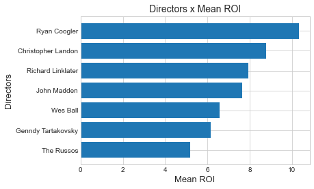

# Microsoft Movie Business Project


**Author**: [Ferdinand Beaman](mailto:Ferdinand.Beaman@gmail.com)

## Overview

This project sets out to consider a hypothetical reality in which [Microsoft](https://www.microsoft.com/en-us/) decides to get into the movie business, and to steer their debut in the right direction. Databases from [imdb.com](https://www.imdb.com/) and [the-numbers.com](https://www.the-numbers.com/) were used. Descriptive analysis should show that "Microsoft" could make well-educated selections regarding what medium the film should be in, what genres the movie should (and should not) be, and what directors to call.

## Business Problem

There are hundreds of thousands of combinations of factors that go into making a movie, and which ones correlate with success may not all be easy to predict or quantify. Microsoft may be able to boil these issues into a handful of core stances to take which could maximize return on investment (ROI), allowing a director to make the more nuanced creative decisions.

## Data

[Imdb.com](https://www.imdb.com/) and [the-numbers.com](https://www.the-numbers.com/) keep vast stores of information about seemingly every film released in theaters, at least those spanning over the years of interest. Categories of data included:
- Runtime
- Budgets
- Revenue
- Staff
- Genre
- Medium (*animation vs live action*)

## Methods

This project focused as much on monetary concerns as possible, ignoring data from other databases concerned with how well rated the movies were. ROI and net profit figures associated with the aforementioned categories of data were isolated. For the two quantitative data types (runtime and budget), their correlation coefficients in regards to revenue were found. Descriptive analysis was used for all categories of data, however. 

## Results

Loosely, it seems as though Marvel's approach of making science-fiction, comedic adventures with action thrown is is exactly what audiences are looking for.


Animated movies, while only a small subset of my sample (about 90 out of 1,200, or slightly under 7%), did clearly do better than their live action counterparts.


Directors was a harder category to pin down, since their sample sizes were all very small and some of them haven't made a notable movie in a while. And while this project generally focuses on ROI over net profit, it's hard to ignore how well the Russo brothers did with their work in the Avengers franchise.





## Conclusions

This project has three conclusions to offer Microsoft in their bid to make a movie:

- **Go Animated.** Since there are several directors to choose from, the hope is that settling on any of the top prospects that are willing to make an animated movie is a safer bet.
- **Sci-Fi and Adventure first** While comedies and action movies are also doing reasonably well, the big stroke of focusing on science fiction/adventure is paramount.
- **Find Ryan Coogler.** His record thus far is very impressive, with no bombs and a diverse set of genres across his films. The Russos and Genndy Tartakovsky are also defensible choices.

### Next Steps

There were a number of blind spots noticed while analyzing the data and even while writing this file:

- **What counts as a contemporary movie?** Should the scope of movies have been tighter or looser than just the last 10 years?
- **What about actors? Writers? VFX teams? Ad firms?** Hundreds of people work on a movies. Not every job was looked at.
- **Did Marvel skew the results?** Is Marvel setting the trend, or just following audience demand?
- **Sweet spots ignored by correlation coefficients?** Is there a perfect runtime? Are there diminishing returns budget-wise?
- **Do some genres not mix? Or mix well?** Fantasy did admirably well across my sample, but it and Sci Fi are often considered mutually exclusive. What genre pairings catalyze one another?

## For More Information

The full analysis is in this [Jupyter Notebook](./Phase_1_Project_Ferdinand_Beaman.ipynb). The summarized [presentation](./presentation.pdf) is also available.

The project author, Ferdinand Beaman, can be reached through email at [Ferdinand.Beaman@gmail.com](mailto:Ferdinand.Beaman@gmail.com)


## Repository Structure

```

├── zippedData
├── images
├── README.md
├── CONTRIBUTING.md
├── LISCENCE.md
├── What_Movie_to_Make.pdf
├── Phase_1_Project_Ferdinand_Beaman.ipynb
└── student-Copy4 (code for the graphs are here)
```